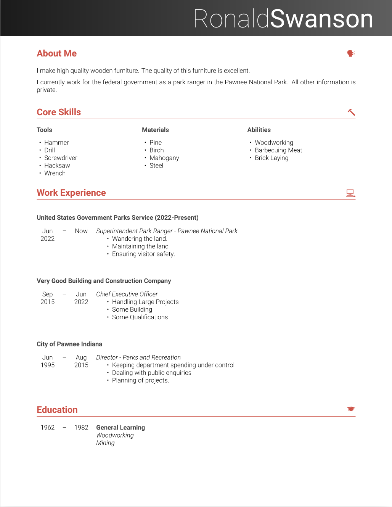
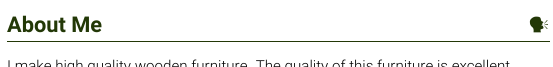

# Minimal CV LaTeX Class

This is a small personal project that defines a LaTeX template class file that
was used for my CV. It is not intended as a large scale project. I have made
this code available under the LaTeX Project Public License (LPPL) for people to
freely use for their own needs.

## Quick Start

Take minimal-cv.cls and use it as the `documentclass` for your own document
(you are free to make use of the provided `example.tex`) to start off a new
document.

    \documentclass{minimal-cv}

## Required Packages

This class depends on several LaTeX packages:

* `array`
* `color`
* `enumitem`
* `fontspec`
* `geometry`
* `parskip`
* `tabularx`
* `textpos`
* `tikz`
* `titlespec`
* `xcolor`

## Required Fonts

The following fonts are used by the class, however you are welcome to edit the
class to choose different fonts:

* Roboto (Light, Thin, Bold variants)
* Symbola

## Choosing The Color Theme

The class includes a set of default colors as shown in the example image above.
You can edit the color theme by changing the values of the colors:

    \definecolor{headerbg}{HTML}{911F03}
    \definecolor{headertext}{HTML}{FFFFFF}
    \definecolor{sectioncolor}{HTML}{233807}
    \definecolor{subsectioncolor}{HTML}{444444}
    \definecolor{textcolor}{HTML}{222222}

## Commands/Environments

The class includes several commands to easily produce CV or résumé document:

### `\sectionicon`

The `\sectionicon` command can be used to place a character at the end of a
section heading. Like this:

The command is used like this:

    \section{About Me}
    \sectionicon{<icon>}

The "icon" can be any Unicode character. The class provides several emoji-style
icons by default (`\person`, `\hammer`, `\laptop`, `\info`, `\mortarboard`,
`\phone`), which can be used like this:

    \sectionicon{\person}

### `coreskills` Environment

The "coreskills" environment defines a list inside a minipage which can
be used to provide a brief list of skills or other knowledge areas:

    \begin{coreskillslist}{Tools}
      \item Hammer
      \item Drill
      \item Screwdriver
      \item Hacksaw
      \item Wrench
    \end{coreskillslist}

This environment takes an optional  width parameter, allowing you to place
multiple lists side-by-side, making optimal use of horizontal space on the
page. See `example.tex` for an example of this.

### `education` Environment

The "education" environment provides you an environment in which you can define
education achievments. Use it in conjunction with the `\school` command:

    \begin{education}
      \school{2001}{2007}{Generic High School}{
        \qualification{GCSE}: Maths (A*)\newline
        \qualification{GCSE}: English (B)\newline
        \qualification{GCSE}: Science (AA)
      }
    \end{education}

The `\school` command accepts four paramters: start year, graduation year,
school name, and details about qualifications obtained at the school.

The `\qualification` command is also available which provides additional
formatting for the type of qualification that was obtained from the school.

### `employment` Environment

Similar to the education environment, the "employment" environment provides an
environment for listing an employer, supporting multiple jobs for the same
employer. Typically you would list each employer in their own subsection.
For example:

    \subsection{ACME Products Corporation}

    \begin{employment}
      \job{Jun 2009}{Now}{Senior Manager}{%
        \begin{itemize}
          \item Verifying product quality
          \item Dealing with customer complaints
        \end{itemize}
      }
      \job{Jun 2009}{Now}{Product Tester}{%
        \begin{itemize}
          \item Testing quality of roadrunner traps
          \item First aid training
        \end{itemize}
      }
    \end{employment}

Each job is enclosed within it's own `\job` command. The `\job` command takes
the following parameters: start month/year, end month/year, position, and job
highlights.

## Authors

* Karl Nicoll (original template author)

## License

The `minimal-cv.cls` file is licensed under the LaTeX Public Project License
v1.3. The `example.tex` file is made freely available without a license.
